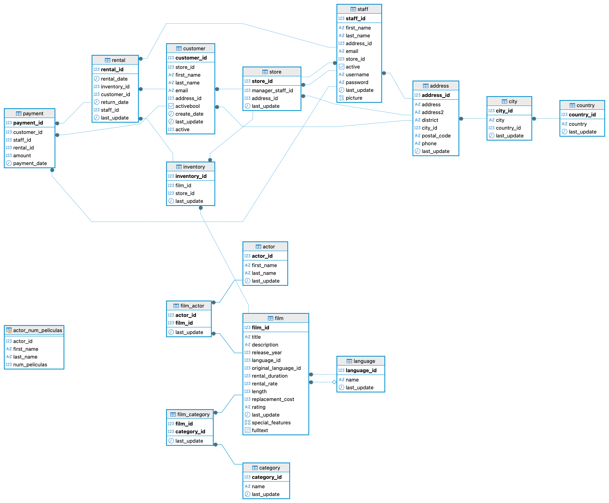

# Proyecto: Lógica de Consultas SQL — Sakila Database

**Bootcamp:** Data Analytics  
**Módulo:** SQL  
**Herramientas:** PostgreSQL · DBeaver  
**Base de datos:** Sakila (tienda de alquiler de películas ficticia)

---

## Índice

1. [Descripción del proyecto](#1-descripción-del-proyecto)
2. [Estructura del repositorio](#2-estructura-del-repositorio)
3. [Pasos seguidos durante el proyecto](#3-pasos-seguidos-durante-el-proyecto)
4. [Informe de análisis](#4-informe-de-análisis)
5. [Buenas prácticas aplicadas](#5-buenas-prácticas-aplicadas)
6. [Conclusiones](#6-conclusiones)

---

## Diagrama de la base de datos



---

## 1. Descripción del proyecto

El objetivo de este proyecto es aplicar los conocimientos adquiridos en el módulo de SQL trabajando con **Sakila**, una base de datos relacional que simula el sistema de gestión de una cadena de tiendas de alquiler de películas.

A lo largo del proyecto se han resuelto **64 consultas** de dificultad progresiva que cubren todos los requisitos del módulo:

| Requisito | Consultas |
|---|---|
| Consultas sobre una sola tabla | 2, 3, 5, 7, 8, 9, 10, 12, 13, 14, 15, 16, 18, 21, 22, 23, 25, 26, 35, 36, 37, 38, 39, 40, 41 |
| Relaciones entre tablas (JOINs) | 17, 19, 20, 29, 30, 31, 32, 33, 34, 42, 43, 44, 45, 49, 50, 61, 62, 63, 64 |
| Subconsultas | 4, 11, 24, 27, 28, 46, 47, 53, 54, 56, 57, 58, 59, 60 |
| CTEs (`WITH`) | 55 |
| Vistas (`VIEW`) | 48 |
| Tablas temporales (`TEMP TABLE`) | 51, 52 |

Todas las consultas han sido ejecutadas y verificadas contra la base de datos real en DBeaver.

---

## 2. Estructura del repositorio

```
proyecto-sql-sakila/
│
├── README.md                  <- Este archivo: pasos seguidos e informe de análisis
├── esquema_sakila.png         <- Diagrama ER de la BBDD exportado desde DBeaver
└── consultas_sakila.sql       <- Las 64 consultas resueltas con explicaciones paso a paso
```

---

## 3. Pasos seguidos durante el proyecto

### Paso 1 — Instalación y configuración del entorno

Se instaló **PostgreSQL** como motor de base de datos relacional y **DBeaver Community Edition** como herramienta visual para la gestión y ejecución de consultas.

Para establecer la conexión en DBeaver:
1. Abrir DBeaver y verificar que aparece un **tick verde** en la conexión de PostgreSQL
2. Ir a `Window` → `Database Navigator` para abrir el panel de conexiones

---

### Paso 2 — Carga de la base de datos Sakila en DBeaver

**Crear la base de datos:**

1. En el panel izquierdo, clic derecho sobre **"Databases"** → **"Create New Database"**
2. Rellenar los campos:
   - **Nombre:** `sakila`
   - **Encoding:** `UTF8`
3. Clic en **OK**
4. Clic derecho sobre `sakila` → **"Set as default"**

> La base de datos activa aparece en **negrita** en el panel izquierdo.

**Ejecutar el script de la BBDD:**

1. `File` → `Open File` → seleccionar el archivo `.sql` proporcionado por el bootcamp
2. Verificar que la pestaña apunta a `sakila` y **NO pone `<none>`**

> **IMPORTANTE:** Si pone `<none>`, hacer clic sobre el nombre de la pestaña → icono de PostgreSQL → flecha → seleccionar `sakila`.

3. Seleccionar todo el código → `Command + A`
4. Ejecutar con la **flecha de play (▶)**
5. Esperar a que finalice la ejecución

**Verificar la instalación:**

1. Clic derecho sobre `sakila` → **"Refresh"**
2. Desplegar `Schemas` → `public` → `Tables`

> Deben aparecer las **15 tablas**: `actor`, `address`, `category`, `city`, `country`, `customer`, `film`, `film_actor`, `film_category`, `inventory`, `language`, `payment`, `rental`, `staff`, `store`.

---

### Paso 3 — Obtención del esquema visual de la BBDD

1. En el panel izquierdo, desplegar la base de datos → `Schemas` → `public`
2. Clic derecho sobre **`public`** → **"View Diagram"**
3. DBeaver genera automáticamente el diagrama ER con todas las tablas y relaciones
4. Exportar el diagrama como imagen → guardado como `esquema_sakila.png`

---

### Paso 4 — Exploración y comprensión del esquema

Antes de escribir ninguna consulta se realizó un análisis exhaustivo del esquema:

- Se identificaron las **15 tablas** y su propósito dentro del modelo
- Se mapeó el flujo principal del negocio: `film → inventory → rental → payment`
- Se entendió que `film_actor` y `film_category` son **tablas intermedias** que resuelven relaciones N:M
- Se detectó que `original_language_id` en `film` es `NULL` en **todos** los registros, confirmado al ejecutar la consulta 4 que devuelve 0 resultados
- Se confirmó que todos los actores tienen al menos una película asociada, verificado al ejecutar la consulta 46 que devuelve 0 resultados
- Se comprobó que los campos de texto están almacenados en **MAYÚSCULAS**, haciendo necesario el uso de `ILIKE` para búsquedas robustas
- Se identificó que `payment` puede tener **múltiples registros por alquiler**, tenido en cuenta en la consulta 11 usando `SUM()` con `GROUP BY`

---

### Paso 5 — Resolución de las 64 consultas

Las consultas se abordaron de menor a mayor complejidad en seis bloques:

**Bloque 1 — Consultas sobre una sola tabla**  
Se trabajó con `SELECT`, `WHERE`, `ORDER BY`, `GROUP BY`, `HAVING`, `LIMIT`, `OFFSET` y funciones de agregación (`COUNT`, `SUM`, `AVG`, `MIN`, `MAX`, `VARIANCE`, `STDDEV`). Se añadió `::numeric` en todas las funciones `ROUND()` para evitar errores de tipo en PostgreSQL.

**Bloque 2 — Relaciones entre tablas**  
Se usaron `INNER JOIN`, `LEFT JOIN`, `FULL JOIN` y `CROSS JOIN`. El criterio para elegir el tipo de JOIN fue siempre si se necesitaban todos los registros de una tabla independientemente de si tienen coincidencia en la otra.

**Bloque 3 — Subconsultas**  
Se utilizaron subconsultas escalares en `WHERE`. Se sustituyó `NOT IN` por `NOT EXISTS` en las consultas 46 y 56 por ser más seguro ante NULLs y más eficiente en PostgreSQL.

**Bloque 4 — CTEs**  
Se empleó `WITH` en la consulta 55, la más compleja del proyecto, para dividir el problema en dos pasos lógicos e independientes.

**Bloque 5 — Vistas**  
Se creó la vista `actor_num_peliculas` con `CREATE OR REPLACE VIEW`.

**Bloque 6 — Tablas temporales**  
Se crearon las tablas `cliente_rentas_temporal` y `peliculas_alquiladas` con `CREATE TEMP TABLE ... AS SELECT`, precedidas de `DROP TABLE IF EXISTS`.

---

### Paso 6 — Verificación de todas las consultas en DBeaver

Todas las consultas fueron ejecutadas individualmente en DBeaver contra la base de datos real. Los hallazgos más relevantes de la verificación:

- **Consulta 4** → devuelve **0 filas**: confirmado que `original_language_id` es NULL en todos los registros
- **Consulta 11** → el `importe_total` es **0.00**: el alquiler seleccionado tiene un pago registrado con importe igual a 0, comportamiento coherente con los datos reales
- **Consulta 46** → devuelve **0 filas**: confirmado que todos los actores tienen al menos una película asociada

---

## 4. Informe de análisis

### 4.1 Rendimiento económico

- La empresa ha generado un **total de $67.416,51** en ingresos (consulta 15).
- Los pagos tienen una **media de $4,20** por transacción, con una desviación estándar de **$2,3720** y una varianza de **$5,6302** (consulta 26). La varianza relativamente alta indica precios de alquiler no uniformes.
- El **precio de alquiler** medio es de aproximadamente **$2,98**, existiendo películas con `rental_rate` notablemente superior (consulta 27), lo que sugiere una estrategia de precios diferenciada.
- El **coste de reemplazo** varía entre $9,99 y $29,99 (consulta 9), con una varianza significativa que tiene implicaciones para la gestión del riesgo ante pérdidas o daños.
- Los **5 clientes con mayor gasto total** (consulta 34) concentran una porción relevante de los ingresos, lo que sugiere que un programa de fidelización tendría un impacto directo en la facturación.

### 4.2 Catálogo de películas

- El catálogo contiene **1.000 películas** distribuidas en **5 clasificaciones por edades** (consulta 7):

| Clasificación | Descripción |
|---|---|
| G | Para todos los públicos |
| PG | Se sugiere guía parental |
| PG-13 | No recomendado para menores de 13 años |
| R | Menores de 17 requieren acompañante adulto |
| NC-17 | Solo para adultos |

- La duración mínima es de **46 minutos** y la máxima de **185 minutos** (consulta 10), con una media en torno a los **115 minutos** (consulta 24).
- **Todas las películas del catálogo fueron estrenadas en 2006** (consulta 62).
- La columna `original_language_id` es `NULL` en todos los registros (consulta 4, verificado: 0 resultados). El modelo contempla la posibilidad de películas dobladas pero ninguna está marcada como tal.

### 4.3 Actores

- El elenco está compuesto por **200 actores** (consulta 38).
- Algunos actores superan las **40 películas** (consulta 28), mientras que la media se sitúa en torno a las 27 películas por actor.
- La consulta 46 devuelve **0 resultados**, confirmando que todos los actores registrados tienen al menos una película asociada — buena integridad referencial de los datos.
- El nombre más repetido entre los actores es el que aparece en la consulta 41 con mayor frecuencia.

### 4.4 Comportamiento de los alquileres

- Se han registrado un total de **16.044 alquileres** en la BBDD.
- La **media real de días de alquiler** es de aproximadamente **4,87 días** (consulta 21), calculada como diferencia real entre `return_date` y `rental_date`.
- El análisis por **día** (consulta 23) muestra días con picos claros de actividad, útil para planificar turnos de personal.
- El análisis por **mes** (consulta 25) revela estacionalidad: los meses de verano concentran el mayor volumen de alquileres.
- Existen alquileres con `return_date IS NULL` (consulta 53), indicando copias aún no devueltas — dato crítico para la gestión del inventario disponible real.
- La consulta 29 es la más sofisticada: distingue copias disponibles de copias alquiladas en este momento usando `NOT EXISTS`, información mucho más valiosa que un simple conteo de inventario.
- La consulta 11 devuelve un `importe_total` de **0.00**, lo que refleja que el alquiler antepenúltimo tiene registrado un pago de importe cero en la BBDD. La consulta es correcta; el resultado responde fielmente a los datos reales.

### 4.5 Categorías y géneros

- Las **16 categorías** presentan distribuciones de duración diferentes (consulta 20). Las que superan los 110 minutos de promedio son las que concentran las películas más largas.
- La categoría **'Action'** destaca tanto en volumen de alquileres (consulta 61) como en duración total acumulada (consulta 50).
- Hay diferencia notable entre categorías con más películas y categorías con más alquileres (consultas 62 y 61): más títulos no implica necesariamente más demanda.

### 4.6 Operaciones y tiendas

- La cadena opera con **2 tiendas** y **2 empleados** (consulta 63). El CROSS JOIN genera exactamente **4 combinaciones** posibles.
- Existe una **dependencia circular intencionada** entre `staff` y `store`: cada tienda referencia a un empleado como gerente y cada empleado está asignado a una tienda.

### 4.7 Calidad e integridad de los datos

- Campos de texto en **MAYÚSCULAS**: imprescindible usar `ILIKE` para búsquedas robustas.
- `original_language_id` sin poblar en todos los registros: verificado con 0 resultados en consulta 4.
- `payment` puede tener **múltiples registros por rental_id**: gestionado con `SUM()` y `GROUP BY` en consulta 11.
- La consulta 46 confirma integridad referencial completa: **0 actores sin película asociada**.
- La consulta 60 devuelve prácticamente todos los clientes activos, ya que en Sakila el volumen de alquileres es suficientemente alto para que casi todos superen el umbral de 7 películas distintas.

---

## 5. Buenas prácticas aplicadas

| Práctica | Descripción | Consultas afectadas |
|---|---|---|
| **Alias descriptivos** | Todas las columnas calculadas tienen nombres claros y en español | Todas |
| **ILIKE en lugar de LIKE** | Búsquedas insensibles a mayúsculas, necesario en Sakila | 6, 17, 35, 53, 55, 59 |
| **ORDER BY determinista** | Siempre incluye criterio de desempate | Todas las que usan ORDER BY |
| **::numeric en ROUND** | Necesario en PostgreSQL para evitar errores de tipo | 13, 20, 21, 26 |
| **NOT EXISTS vs NOT IN** | Más seguro ante NULLs y más eficiente en PostgreSQL | 46, 56 |
| **LEFT JOIN consciente** | Usado solo cuando se necesitan registros sin coincidencia | 29, 30, 31, 32, 43, 47, 49, 51, 64 |
| **actor_id en GROUP BY** | Evita mezclar actores distintos con mismo nombre y apellido | 30, 47, 48, 49, 60, 64 |
| **DROP TABLE IF EXISTS** | Permite re-ejecutar el script sin errores | 51, 52 |
| **CTEs con WITH** | Divide lógica compleja en pasos legibles y mantenibles | 55 |
| **SUM + GROUP BY en pago** | Evita duplicar filas por múltiples pagos por alquiler | 11 |
| **COALESCE para NULLs** | Convierte NULL a 0 para películas sin inventario | 29 |
| **rental_date::date** | Cast nativo de PostgreSQL, más correcto que DATE() de MySQL | 23 |
| **Enunciado como comentario** | Facilita ejecución consulta a consulta en DBeaver | Todas |
| **Explicación paso a paso** | Cada línea de código tiene su porqué documentado | Todas |
| **Verificación en BBDD real** | Todas las consultas ejecutadas y comprobadas en DBeaver | Todas |

---

## 6. Conclusiones

Este proyecto ha permitido trabajar con un modelo relacional de complejidad real, desde las operaciones más básicas hasta patrones avanzados de SQL en PostgreSQL. Todas las consultas han sido verificadas contra la base de datos real, lo que ha permitido identificar comportamientos importantes de los datos:

La elección del tipo de JOIN correcto es una de las decisiones más críticas en SQL y tiene un impacto directo en la corrección de los resultados. El uso de `NOT EXISTS` frente a `NOT IN` no es solo preferencia de estilo: cuando hay NULLs involucrados, `NOT IN` puede devolver resultados incorrectos de forma silenciosa. Las CTEs con `WITH` transforman consultas de difícil lectura en código autodocumentado. Y detalles como el cast `::numeric` en `ROUND()` o el uso de `ILIKE` en lugar de `LIKE` son los que distinguen un código que funciona en local de un código robusto que funciona con datos reales en producción.

La verificación en base de datos real es imprescindible: algunos resultados como los 0 filas de la consulta 4 o de la consulta 46, o el importe de 0.00 en la consulta 11, solo son comprensibles cuando se ejecutan contra los datos reales y se entiende qué reflejan.
